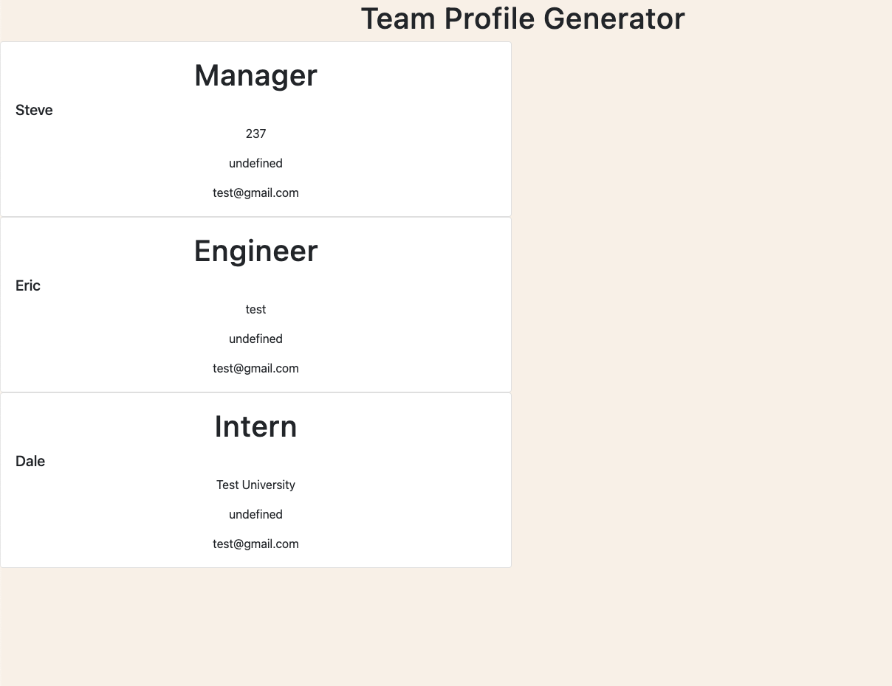

# Team-Profile-Generator

GitHub Repo - https://github.com/CNRBanks/Team-Profile-Generator

# Description

This app allows users to enter employee information into the terminal and have the data populate on an html page.

# Table of Contents

- [Preview](#preview)
- [Installation](#installation)
- [Usage](#usage)
- [License](#license)
- [Contributing](#contributing)
- [Tests](#tests)

# Preview

# Installation

Necessary to install inquirer and jest

# Usage

To build your team profile you will need to open the index.js file in terminal, run node index, enter prompts as necessary, and complete team when finished. Once finished open the teamProfiles.html file in your browser to see your teams profiles!

# License

Copyright <2022> <Connor Banks>

Permission is hereby granted, free of charge, to any person obtaining a copy of this software and associated documentation files (the "Software"), to deal in the Software without restriction, including without limitation the rights to use, copy, modify, merge, publish, distribute, sublicense, and/or sell copies of the Software, and to permit persons to whom the Software is furnished to do so, subject to the following conditions:

The above copyright notice and this permission notice shall be included in all copies or substantial portions of the Software.

THE SOFTWARE IS PROVIDED "AS IS", WITHOUT WARRANTY OF ANY KIND, EXPRESS OR IMPLIED, INCLUDING BUT NOT LIMITED TO THE WARRANTIES OF MERCHANTABILITY, FITNESS FOR A PARTICULAR PURPOSE AND NONINFRINGEMENT. IN NO EVENT SHALL THE AUTHORS OR COPYRIGHT HOLDERS BE LIABLE FOR ANY CLAIM, DAMAGES OR OTHER LIABILITY, WHETHER IN AN ACTION OF CONTRACT, TORT OR OTHERWISE, ARISING FROM, OUT OF OR IN CONNECTION WITH THE SOFTWARE OR THE USE OR OTHER DEALINGS IN THE SOFTWARE.

# Contributing

W3Schools JavaScript - https://my-learning.w3schools.com/tutorial/js
W3Schools HTML - https://my-learning.w3schools.com/tutorial/html
W3Schools CSS - https://my-learning.w3schools.com/tutorial/css
W3Schools Node JS - https://my-learning.w3schools.com/tutorial/nodejs

# Tests

Ensure that jest has been properly installed, then run npm test to verify tests.
